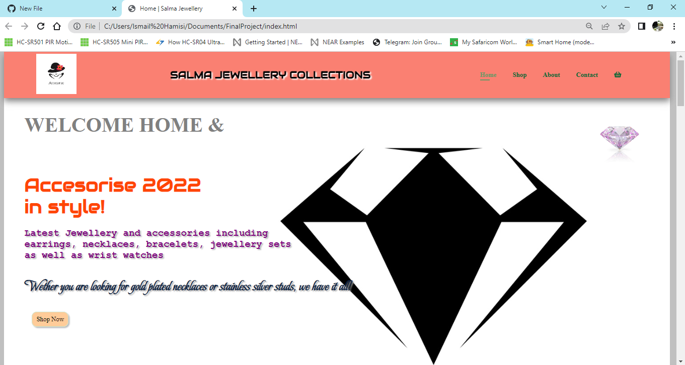
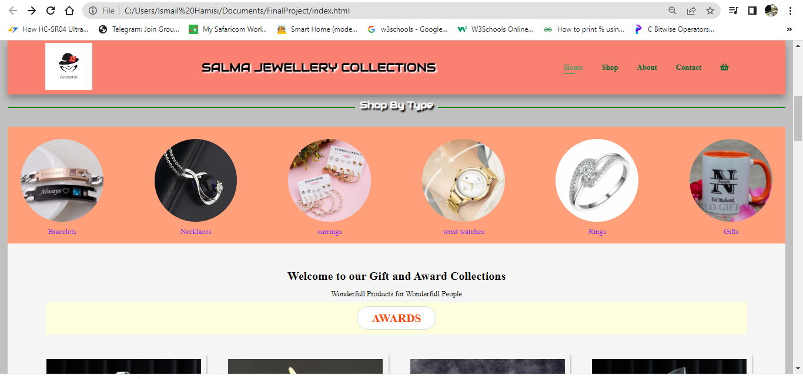
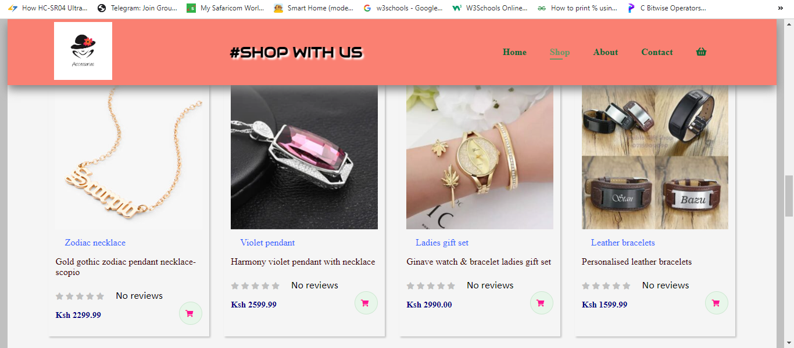
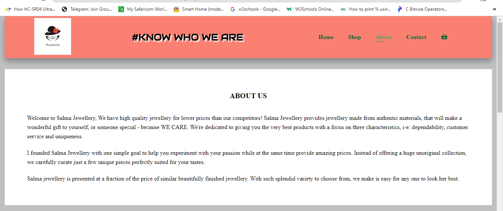
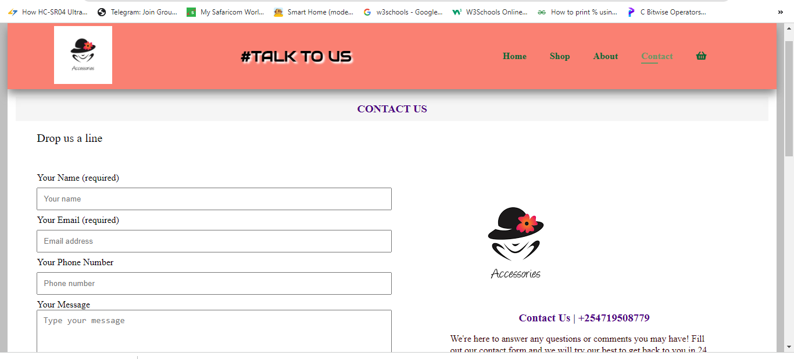
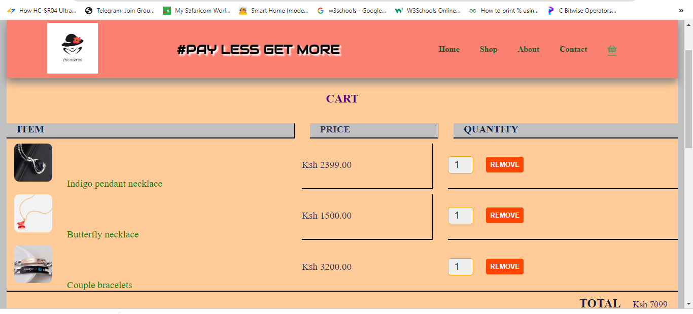

# PLP_FinalProject
## This is an eCommerce website for jewellery and accessories.
  
This website consists of a navigation bar which allow users to navigate between different pages i.e, home, about, shop, contact and cart pages.
You can also click on the 'Shop Now' button at the bottom left side of the page below which directly takes you to the shop page

#### Home page with its navigation bar =>
    

From the 'homepage' the user can scroll down to 'shop by type' where they can explore the different types of accessories in stock.
#### Shop by type =>
    

Inside the 'shop page' one can see the products available with their title, description, price and their rating as well.  
There is also a shopping cart button which allow customers to add their items to cart by clicking on it. 
#### Shop page =>
    

The 'About page' has information about us whereas the 'contact page' is a platform where customers can talk to us direct via messages  
   
    

Finally we have our 'cart page' which stores all items added to cart. From this page, you can either increase or reduce the number of a particular
product you want to purchase. The system automatically does the computation of the products in the cart and gives the total cost.  
You can as well remove any item you wish to by clicking on the remove button and again the total cost is deducted accordingly.  
Once you are ready to purchase your items just click on the purchase button. A thank you message will pop up and all items will be cleared from the cart.
  

#### Cart page =>
    

#### Proper styling has been done to this website to make it attractive and user friendly.  

### The languages used to write this website are listed below 
- HTML 
- CSS 
- JavaScript 

I am still working on this project to allow users to make their payments via credit card 💳 or mpesa before purchasing their products. I am also working on the cart 🛒 so that the number of items in it can be visible on top of the cart icon.

